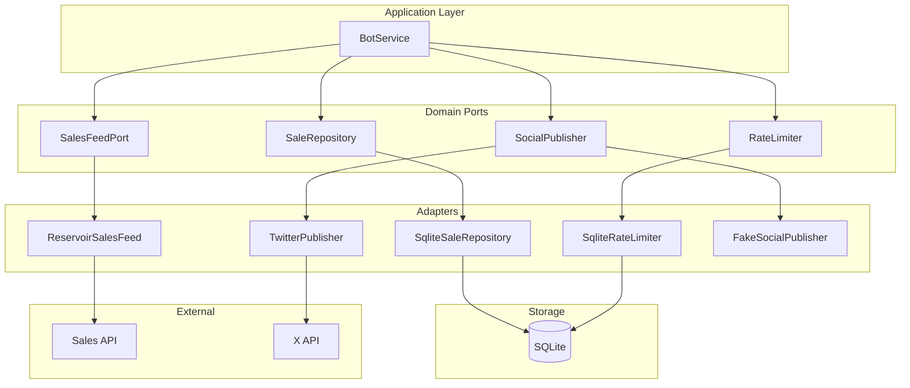
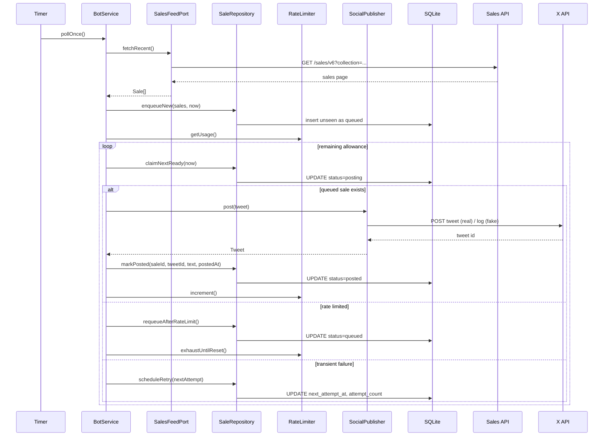

# Terraforms Bot — Architecture & Operations

This document captures the full project context: requirements, behavior, data model, adapters, and how the hexagonal layout is wired. It is intended to be enough to restore the project direction in a fresh conversation.

## Problem & Scope

-   Poll a private sales API (Reservoir-like `/sales/v6`) for a single collection.
-   On new sales, post to X (Twitter) respecting free-tier rate limit (17/day, reset at configurable UTC hour).
-   First run seeds current feed as seen (no posts) to avoid historical backfill.
-   Persist state for crash recovery (queue, attempts, posting state, rate usage, pruning) in SQLite.
-   Optional timeline check to confirm “in-flight” posts after crashes using tweet content matching.
-   Current default uses a fake publisher for local QA; switch to real X publisher for prod.

## Configuration (env)

-   `SALES_API_BASE_URL` — base URL; `/sales/v6` is appended.
-   `SALES_API_KEY` — x-api-key header.
-   `SALES_COLLECTION_ADDRESS` — contract address query param.
-   `POLL_INTERVAL_MS` — poll cadence.
-   `RATE_LIMIT_MAX_PER_DAY` — daily post allowance (default 17).
-   `RATE_LIMIT_RESET_HOUR_UTC` — hour of reset (default 0).
-   `DB_PATH` — SQLite path (default `./data/bot.sqlite.db`).
-   `TWEET_TEMPLATE` — default `"#{tokenId} - {name} - {price} {symbol} (take-{orderSide})"`.
-   X creds (for real posting): `X_APP_KEY`, `X_APP_SECRET`, `X_ACCESS_TOKEN`, `X_ACCESS_SECRET`, optional `X_USER_ID`/`X_USERNAME`.

## Behavior

-   **Bootstrap (first run):** fetch current feed, mark as seen (status `seen`), set `initialized=1`.
-   **Polling loop:**
    1. Fetch recent sales (page of 100, sorted desc).
    2. Filter washTradingScore ≠ 0 and isDeleted = true; map fields.
    3. Enqueue unseen as `queued` with attempt_count = 0.
    4. Post while remaining daily allowance > 0.
-   **Posting:** format tweet from template; on success mark posted and increment rate usage.
-   **429:** requeue, mark local rate usage to limit (halts until window reset).
-   **Non-429 errors:** exponential backoff (1m → 2m → … → 30m) via `next_attempt_at`, attempt_count++.
-   **Recovery:** on startup, find `posting` older than `stalePostingSeconds` (120s), compare against recent timeline (tokenId + price + symbol + side) to mark posted or requeue.
-   **Pruning:** delete posted/failed/seen older than 30 days, at most every 6h.

## Data Model (SQLite)

-   `meta(key, value)` — initialized flag, rate window/used, last_prune_at.
-   `sales` — sale_id (PK), created_at, seen_at, enqueued_at, posting_at, posted_at, status (seen/queued/posting/posted/failed), tweet_id, tweet_text, payload (JSON), next_attempt_at, attempt_count. Indexes on status/next_attempt_at/created_at, posted_at.

## Components (Hexagonal)

-   **Application** (`src/application/botService.ts`): orchestrates polling, posting, recovery, pruning.
-   **Domain ports** (`src/domain/ports/*`): SalesFeedPort, SaleRepository, RateLimiter, SocialPublisher.
-   **Domain models** (`src/domain/models.ts`): Sale, Price, Tweet, OrderSide.
-   **Adapters (infra):**
    -   ReservoirSalesFeed (`src/infra/http/reservoirSalesFeed.ts`)
    -   SqliteSaleRepository (`src/infra/sqlite/saleRepository.ts`)
    -   SqliteRateLimiter (`src/infra/sqlite/rateLimiter.ts`)
    -   TwitterPublisher (real) (`src/infra/twitter/twitterPublisher.ts`)
    -   FakeSocialPublisher (QA) (`src/infra/social/fakePublisher.ts`)
-   **Utilities:** tweetFormatter, backoff, logger, migrations.

## Posting Template

`#{tokenId} - {name} - {price} {symbol} (take-{orderSide})`

Price uses up to 4 decimals (trim trailing zeros). `orderSide` normalized to `ask`/`bid` where possible.

## Recovery Matching

-   Primary: exact formatted tweet.
-   Secondary: contains `#tokenId`, `"{price} {symbol}"`, and `(take-{orderSide})`.

## Deployment

-   Single Docker image (Node 24 alpine, Yarn PnP). Volume `/data` for SQLite. Use `.env` file for secrets.
-   For prod, switch publisher in `src/index.ts` from FakeSocialPublisher to TwitterPublisher.

## Testing

-   Vitest suite (unit-level):
    -   `botService.test.ts` — bootstrap, posting, 429 deferral, retry scheduling.
    -   `sqliteRepo.test.ts` — enqueue/claim/post, retry scheduling, pruning.
    -   `recovery.test.ts` — stale posting recovery match/no-match.
-   Run with `yarn test` (ensure env/tools allow child processes; otherwise use real terminal, not timeout wrapper).

## C4 (Component level) — Mermaid

## Sequence — Main Loop (Mermaid)

