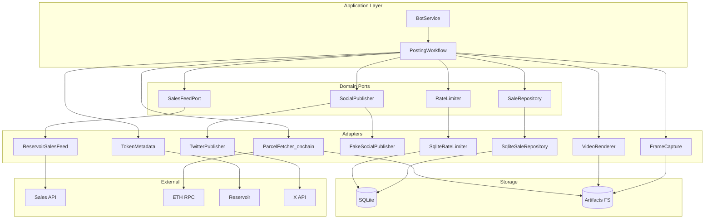

# Terraforms Bot — Architecture & Operations

This document captures the full project context: requirements, behavior, data model, adapters, and how the hexagonal layout is wired. It is intended to be enough to restore the project direction in a fresh conversation.

## Problem & Scope

-   Poll a private sales API (Reservoir-like `/sales/v6`) for a single collection.
-   On new sales, post to X (Twitter) respecting free-tier rate limit (17/day, reset at configurable UTC hour).
-   First run seeds current feed as seen (no posts) to avoid historical backfill.
-   Persist state for crash recovery (queue, attempts, posting state, rate usage, pruning) in SQLite.
-   Optional timeline check to confirm “in-flight” posts after crashes using tweet content matching.
-   Publisher toggle via `USE_FAKE_PUBLISHER` (default real X; set true to log locally for QA).

## Configuration (env)

-   `SALES_API_BASE_URL` — base URL; `/sales/v6` is appended.
-   `SALES_API_KEY` — x-api-key header.
-   `SALES_COLLECTION_ADDRESS` — contract address query param.
-   `POLL_INTERVAL_MS` — poll cadence.
-   `DB_PATH` — SQLite path (default `./data/bot.sqlite.db`).
-   `TWEET_TEMPLATE` — default multi-line: `"#{tokenId} | {name} | {price} {symbol} (take-{orderSide})\n{Mode} {Chroma}{Antenna}\n{Zone} B{Biome}"`.
-   `USE_FAKE_PUBLISHER` — set to `true` to log locally instead of posting to X (default: false).
-   X creds (for real posting): `X_APP_KEY`, `X_APP_SECRET`, `X_ACCESS_TOKEN`, `X_ACCESS_SECRET`, optional `X_USER_ID`/`X_USERNAME`.

## Behavior

-   **Bootstrap (first run):** fetch current feed, mark as seen (status `seen`), set `initialized=1`.
-   **Polling loop:**
    1. Fetch recent sales (page of 100, sorted desc).
    2. Filter washTradingScore ≠ 0 and isDeleted = true; map fields.
    3. Enqueue unseen as `queued` with attempt_count = 0.
    4. Process queued within daily allowance.
-   **Posting pipeline (per sale):**
    1. `fetching_html`: on-chain HTML via viem against Terraforms contract (override renderer version 2), writes `token-<id>.html` under `data/artifacts/<sale_id>/`.
    2. `capturing_frames`: Puppeteer screencast (no-sandbox args, viewport 1200x1732, heartbeat repaint) to frames `frame_0000.png`…; streaming/buffered supported; measured FPS persisted.
    3. `rendering_video`: ffmpeg (`libx264`, profile high, CRF 18, bitrate caps, yuv420p, faststart) into `video.mp4` using measured FPS.
    4. `fetch_metadata`: Reservoir `/tokens/v7` to enrich Mode/Chroma/Zone/Biome/Antenna (stored as JSON).
    5. `uploading_media`: X chunked upload of video; `media_id` + `media_uploaded_at` persisted (re-upload if older than 24h).
    6. `posting`: post enriched multi-line text with `media_ids`; on success mark posted, increment rate usage, clean artifacts.
-   **429:** read `x-ratelimit-*` headers, set `next_attempt_at` to the reset (with buffer), record remote cooldown, exhaust local usage, and halt until reset.
-   **Non-429 errors:** exponential backoff (1m → 2m → … → 30m) via `next_attempt_at`, attempt_count++.
-   **Recovery:** on startup, find `posting` older than `stalePostingSeconds` (120s), compare against recent timeline (tokenId + price + symbol + side) to mark posted or requeue.
-   **Pruning:** delete posted/failed/seen older than 30 days, at most every 6h.

### Rate limiting

-   A single rate controller (inside `TwitterPublisher`) owns all X rate logic for posting. It persists header-derived state in `meta` (`rate_state_post`) and rejects calls when `remaining` would consume the reserved slot (keeps the 17th request unused).
-   State heals after reset: if the stored `reset` has passed, remaining is restored to the limit before the next call. When headers are missing, a synthetic reset is stored using per-slot spacing (~84m for 17/day) anchored to the last spent request so the system can self-heal without new requests. `checkRateLimit` reads the stored post snapshot (no `/2/users/me` network probe) to avoid exhausting the `/me` bucket.
-   Headers are parsed with preference for the `userDay` bucket to align with free-tier caps. On success/429, state is refreshed from headers; if headers are missing, the controller cautiously decrements the stored remaining and sets a short fallback recovery window.
-   Exponential backoff for 429s starts at 1s, doubles up to 2h, and is clamped to the `x-ratelimit-reset` minus a small buffer so retries never pre-date the reset; non-rate errors still back off (1m → 2m → … → 30m).

## Data Model (SQLite)

-   `meta(key, value)` — initialized flag, rate_state_post/me JSON, last_prune_at.
-   `sales` — sale_id (PK), created_at, seen_at, enqueued_at, posting_at, posted_at, status (`seen|queued|fetching_html|capturing_frames|rendering_video|uploading_media|posting|posted|failed`), tweet_id/text, payload (JSON), next_attempt_at, attempt_count, html_path, frames_dir, video_path, media_id, media_uploaded_at, metadata_json, capture_fps. Indexes on status/next_attempt_at/created_at, posted_at.

## Components (Hexagonal)

-   **Application** (`src/application/botService.ts`) orchestrates polling/recovery; **Workflow** (`src/application/workflow.ts`) runs the media pipeline per sale.
-   **Domain ports** (`src/domain/ports/*`): SalesFeedPort, SaleRepository, SocialPublisher.
-   **Domain models** (`src/domain/models.ts`): Sale, Price, Tweet, OrderSide.
-   **Adapters (infra):**
    -   ReservoirSalesFeed (`src/infra/http/reservoirSalesFeed.ts`)
    -   SqliteSaleRepository (`src/infra/sqlite/saleRepository.ts`)
    -   TwitterPublisher (real) / FakeSocialPublisher (QA)
    -   On-chain parcel fetcher (`src/infra/onchain/parcelFetcher.ts`)
    -   Frame capture (`src/infra/capture/frameCapture.ts`)
    -   Video renderer (`src/infra/capture/videoRenderer.ts`)
    -   Token metadata (`src/infra/http/tokenMetadata.ts`)
-   **Utilities:** tweetFormatter, backoff, logger, migrations.

## Posting Template

Default multi-line template:

```
#{tokenId} | {name} | {price} {symbol} (take-{orderSide})
{Mode} {Chroma}{Antenna}
{Zone} B{Biome}
```

Price uses up to 4 decimals (trim trailing zeros). `orderSide` normalized to `ask`/`bid` where possible. Antenna adds `[A]` when On. Biome prefixed with `B`.

## Recovery Matching

-   Primary: exact formatted tweet.
-   Secondary: contains `#tokenId`, `"{price} {symbol}"`, and `(take-{orderSide})`.

## Deployment

-   Single Docker image (Node 24 alpine, Yarn PnP). Volume `/data` for SQLite. Use `.env` file for secrets.
-   `USE_FAKE_PUBLISHER` (default false) controls whether posts go to X (real) or just log locally (fake).

## Testing

-   Vitest suite (unit-level):
    -   `botService.test.ts` — bootstrap, posting, 429 deferral, retry scheduling.
    -   `sqliteRepo.test.ts` — enqueue/claim/post, retry scheduling, pruning.
    -   `recovery.test.ts` — stale posting recovery match/no-match.
-   Run with `yarn test` (ensure env/tools allow child processes; otherwise use real terminal, not timeout wrapper).

## C4 (Component level) — Mermaid



## Sequence — Main Loop (Mermaid)

```mermaid
sequenceDiagram
    autonumber

    box "Orchestration" #f9f9f9
        participant Timer
        participant Bot as BotService
        participant Flow as Workflow
        participant Rate as RateLimiter
    end

    box "Data & Storage" #ececff
        participant Repo
        participant DB
        participant FS as Artifacts
    end

    box "External Systems" #fff5e6
        participant Feed
        participant API as SalesAPI
        participant RPC as TerraRPC
        participant Res as Reservoir
        participant Pub as Publisher
        participant X as XAPI
    end

    Timer->>Bot: pollOnce

    rect rgb(240, 248, 255)
        note right of Bot: Ingestion Phase
        Bot->>Feed: fetchRecent
        Feed->>API: fetch sales
        API-->>Feed: sales page
        Feed-->>Bot: sales list
        Bot->>Repo: enqueueNew
        Repo->>DB: write queued
    end

    Bot->>Rate: getUsage

    loop remaining allowance
        Bot->>Repo: claimNextReady
        Repo-->>Bot: sale + artifacts/status

        alt No sale available
            Bot-->>Bot: Break Loop
        else Sale available
            Bot->>Pub: checkRateLimit (cached)
            alt remaining == 0
                Bot->>Repo: requeueAfterRateLimit(reset)
                Repo->>DB: update next_attempt_at
                Bot->>Rate: exhaustUntilReset
                Bot-->>Bot: Break Loop
            else remaining > 0
                Bot->>Flow: process sale
                activate Flow

                note right of Flow: Processing Phase
                Flow->>Repo: status fetching_html
                Flow->>RPC: fetch token HTML
                Flow->>FS: save html

                Flow->>Repo: status capturing_frames
                Flow->>FS: capture frames
                Flow->>Repo: save frames + fps

                Flow->>Repo: status rendering_video
                Flow->>FS: render video
                Flow->>Repo: save video path

                Flow->>Repo: status fetch_metadata
                Flow->>Res: fetch attributes
                Flow->>Repo: save metadata

                Flow->>Repo: status uploading_media
                Flow->>Pub: upload video
                Pub->>X: chunked upload
                alt X returns 429
                    X-->>Pub: 429 + rate headers
                    Pub-->>Flow: RateLimit error
                    Flow-->>Bot: throw RateLimitExceeded
                    Bot->>Repo: requeueAfterRateLimit(reset)
                    Repo->>DB: update next_attempt_at
                    Bot->>Rate: exhaustUntilReset
                    deactivate Flow
                    Bot-->>Bot: Break Loop
                else Upload ok
                    X-->>Pub: media id + headers
                    Pub-->>Flow: media id
                    Flow->>Repo: save media id

                    Flow->>Repo: status posting
                    Flow->>Pub: post text + media
                    Pub->>X: POST tweet
                    alt X returns 429
                        X-->>Pub: 429 + rate headers
                        Pub-->>Flow: RateLimit error
                        Flow-->>Bot: throw RateLimitExceeded
                        Bot->>Repo: requeueAfterRateLimit(reset)
                        Repo->>DB: update next_attempt_at
                        Bot->>Rate: exhaustUntilReset
                        deactivate Flow
                        Bot-->>Bot: Break Loop
                    else Posted
                        X-->>Pub: tweet id + headers
                        Pub-->>Flow: tweet
                        Flow->>Repo: mark posted
                        Flow->>Rate: increment
                        Flow->>FS: cleanup artifacts
                        deactivate Flow
                    end
                end
            end
        end
    end
```
