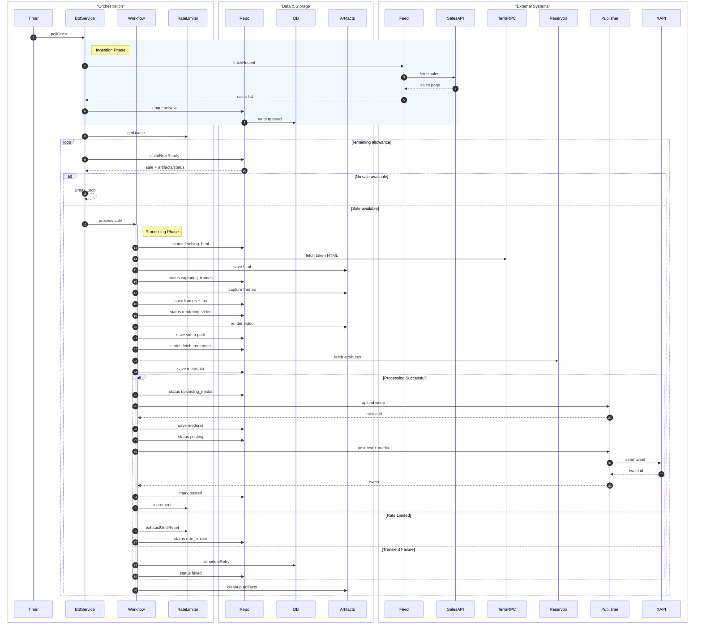

# Terraforms Bot — Architecture & Operations

This document captures the full project context: requirements, behavior, data model, adapters, and how the hexagonal layout is wired. It is intended to be enough to restore the project direction in a fresh conversation.

## Problem & Scope

-   Poll a private sales API (Reservoir-like `/sales/v6`) for a single collection.
-   On new sales, post to X (Twitter) respecting free-tier rate limit (17/day, reset at configurable UTC hour).
-   First run seeds current feed as seen (no posts) to avoid historical backfill.
-   Persist state for crash recovery (queue, attempts, posting state, rate usage, pruning) in SQLite.
-   Optional timeline check to confirm “in-flight” posts after crashes using tweet content matching.
-   Current default uses a fake publisher for local QA; switch to real X publisher for prod.

## Configuration (env)

-   `SALES_API_BASE_URL` — base URL; `/sales/v6` is appended.
-   `SALES_API_KEY` — x-api-key header.
-   `SALES_COLLECTION_ADDRESS` — contract address query param.
-   `POLL_INTERVAL_MS` — poll cadence.
-   `RATE_LIMIT_MAX_PER_DAY` — daily post allowance (default 17).
-   `RATE_LIMIT_RESET_HOUR_UTC` — hour of reset (default 0).
-   `DB_PATH` — SQLite path (default `./data/bot.sqlite.db`).
-   `TWEET_TEMPLATE` — default multi-line: `"#{tokenId} | {name} | {price} {symbol} (take-{orderSide})\n{Mode} {Chroma}{Antenna}\n{Zone} B{Biome}"`.
-   X creds (for real posting): `X_APP_KEY`, `X_APP_SECRET`, `X_ACCESS_TOKEN`, `X_ACCESS_SECRET`, optional `X_USER_ID`/`X_USERNAME`.

## Behavior

-   **Bootstrap (first run):** fetch current feed, mark as seen (status `seen`), set `initialized=1`.
-   **Polling loop:**
    1. Fetch recent sales (page of 100, sorted desc).
    2. Filter washTradingScore ≠ 0 and isDeleted = true; map fields.
    3. Enqueue unseen as `queued` with attempt_count = 0.
    4. Process queued within daily allowance.
-   **Posting pipeline (per sale):**
    1. `fetching_html`: on-chain HTML via viem against Terraforms contract (override renderer version 2), writes `token-<id>.html` under `data/artifacts/<sale_id>/`.
    2. `capturing_frames`: Puppeteer screencast (no-sandbox args, viewport 1200x1732, heartbeat repaint) to frames `frame_0000.png`…; streaming/buffered supported; measured FPS persisted.
    3. `rendering_video`: ffmpeg (`libx264`, profile high, CRF 18, bitrate caps, yuv420p, faststart) into `video.mp4` using measured FPS.
    4. `fetch_metadata`: Reservoir `/tokens/v7` to enrich Mode/Chroma/Zone/Biome/Antenna (stored as JSON).
    5. `uploading_media`: X chunked upload of video; `media_id` persisted.
    6. `posting`: post enriched multi-line text with `media_ids`; on success mark posted, increment rate usage, clean artifacts.
-   **429:** requeue (clear posting_at, next_attempt_at) and exhaust local usage to halt until window reset.
-   **Non-429 errors:** exponential backoff (1m → 2m → … → 30m) via `next_attempt_at`, attempt_count++.
-   **Recovery:** on startup, find `posting` older than `stalePostingSeconds` (120s), compare against recent timeline (tokenId + price + symbol + side) to mark posted or requeue.
-   **Pruning:** delete posted/failed/seen older than 30 days, at most every 6h.

## Data Model (SQLite)

-   `meta(key, value)` — initialized flag, rate window/used, last_prune_at.
-   `sales` — sale_id (PK), created_at, seen_at, enqueued_at, posting_at, posted_at, status (`seen|queued|fetching_html|capturing_frames|rendering_video|uploading_media|posting|posted|failed`), tweet_id/text, payload (JSON), next_attempt_at, attempt_count, html_path, frames_dir, video_path, media_id, metadata_json, capture_fps. Indexes on status/next_attempt_at/created_at, posted_at.

## Components (Hexagonal)

-   **Application** (`src/application/botService.ts`) orchestrates polling/recovery; **Workflow** (`src/application/workflow.ts`) runs the media pipeline per sale.
-   **Domain ports** (`src/domain/ports/*`): SalesFeedPort, SaleRepository, RateLimiter, SocialPublisher.
-   **Domain models** (`src/domain/models.ts`): Sale, Price, Tweet, OrderSide.
-   **Adapters (infra):**
    -   ReservoirSalesFeed (`src/infra/http/reservoirSalesFeed.ts`)
    -   SqliteSaleRepository (`src/infra/sqlite/saleRepository.ts`)
    -   SqliteRateLimiter (`src/infra/sqlite/rateLimiter.ts`)
    -   TwitterPublisher (real) / FakeSocialPublisher (QA)
    -   On-chain parcel fetcher (`src/infra/onchain/parcelFetcher.ts`)
    -   Frame capture (`src/infra/capture/frameCapture.ts`)
    -   Video renderer (`src/infra/capture/videoRenderer.ts`)
    -   Token metadata (`src/infra/http/tokenMetadata.ts`)
-   **Utilities:** tweetFormatter, backoff, logger, migrations.

## Posting Template

Default multi-line template:

```
#{tokenId} | {name} | {price} {symbol} (take-{orderSide})
{Mode} {Chroma}{Antenna}
{Zone} B{Biome}
```

Price uses up to 4 decimals (trim trailing zeros). `orderSide` normalized to `ask`/`bid` where possible. Antenna adds `[A]` when On. Biome prefixed with `B`.

## Recovery Matching

-   Primary: exact formatted tweet.
-   Secondary: contains `#tokenId`, `"{price} {symbol}"`, and `(take-{orderSide})`.

## Deployment

-   Single Docker image (Node 24 alpine, Yarn PnP). Volume `/data` for SQLite. Use `.env` file for secrets.
-   For prod, switch publisher in `src/index.ts` from FakeSocialPublisher to TwitterPublisher.

## Testing

-   Vitest suite (unit-level):
    -   `botService.test.ts` — bootstrap, posting, 429 deferral, retry scheduling.
    -   `sqliteRepo.test.ts` — enqueue/claim/post, retry scheduling, pruning.
    -   `recovery.test.ts` — stale posting recovery match/no-match.
-   Run with `yarn test` (ensure env/tools allow child processes; otherwise use real terminal, not timeout wrapper).

## C4 (Component level) — Mermaid

```mermaid
flowchart TD
    subgraph App[Application Layer]
        BS[BotService]
        WF[PostingWorkflow]
    end

    subgraph Domain[Domain Ports]
        SF[SalesFeedPort]
        SR[SaleRepository]
        RL[RateLimiter]
        SP[SocialPublisher]
    end

    subgraph Infra[Adapters]
        RSS[ReservoirSalesFeed]
        DBR[SqliteSaleRepository]
        DBL[SqliteRateLimiter]
        TW[TwitterPublisher]
        FAKE[FakeSocialPublisher]
        ONC[ParcelFetcher (on-chain)]
        CAP[FrameCapture (Puppeteer)]
        REND[VideoRenderer (ffmpeg)]
        META[TokenMetadata]
    end

    BS --> WF
    WF --> SF
    WF --> SR
    WF --> RL
    WF --> SP
    WF --> ONC
    WF --> CAP
    WF --> REND
    WF --> META

    SF --> RSS
    SR --> DBR
    RL --> DBL
    SP --> TW
    SP --> FAKE
    ONC --> RSS

    subgraph Storage
        SQL[(SQLite)]
        FS[(Artifacts FS)]
    end

    DBR --> SQL
    DBL --> SQL
    CAP --> FS
    REND --> FS
    ONC --> FS

    subgraph External
        API[Sales API]
        RPC[ETH RPC]
        RSV[Reservoir]
        XAPI[X API]
    end

RSS --> API
ONC --> RPC
META --> RSV
TW --> XAPI
```

## Sequence — Main Loop (Mermaid)


